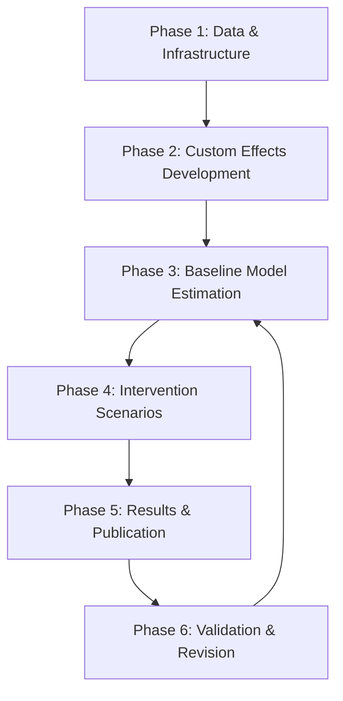

# Research Implementation Plan: Network Dynamics of Tolerance
## A SAOM-Based Investigation of Tolerance Interventions for Interethnic Cooperation

*Utrecht University - Department of Statistical Sociology*

---

## Executive Summary

To bridge the paucity in network-based tolerance intervention research, we pursue two objectives: (1) develop a friend-based attraction-repulsion SAOM framework, and (2) identify optimal intervention designs for sustained interethnic cooperation. Single-model inference risks ignoring intervention-design uncertainty; we therefore employ systematic scenario exploration across targeting strategies, contagion types, and delivery methods.

---

## 1. Research Architecture

### 1.1 Core Implementation Phases



### 1.2 Feedback Loop Structure

Each phase includes explicit validation gates:
- **Convergence Gate**: t-ratios < 0.1, max ratio < 0.25
- **GOF Gate**: Acceptable p-values for degree, geodesic, triad distributions
- **Theory Gate**: Empirical support for attraction-repulsion mechanism
- **Publication Gate**: ≤10,000 words, top-tier journal standards

---

## 2. Phase 1: Data Infrastructure & Validation

### 2.1 Data Acquisition Strategy

**Primary Path**: Together for Tolerance Follow-up Data
```r
# Expected structure from German school study
# 5,825 observations, 2,585 respondents, 105 classes, 3 schools, 3 waves
# Variables: friendship networks, tolerance scores, ethnicity, gender, class
```

**Contingency Path**: Synthetic Data Generation
```r
# If empirical data unavailable, create synthetic data matching known parameters
# Preserves: network density, clustering, homophily patterns
# Calibrated to German school network characteristics
```

### 2.2 Implementation Tasks

1. **Data Loading & Cleaning** (`R/data_processing/01_load_data.R`)
   - Load friendship adjacency matrices [N × N × 3]
   - Process tolerance behavior matrices [N × 3]
   - Code structural constraints (10/11 codes)
   - Handle composition changes

2. **Validation Checks** (`R/data_processing/02_validate_data.R`)
   - Jaccard stability assessment (target > 0.30)
   - Network density evolution
   - Behavior monotonicity checks
   - Missing data patterns

3. **RSiena Object Creation** (`R/data_processing/03_create_siena.R`)
   - sienaDependent for networks and behaviors
   - Covariate preparation (ethnicity, gender)
   - sienaDataCreate with full specification

### 2.3 Validation Criteria

```r
# Minimum acceptable thresholds
jaccard_threshold <- 0.30  # Network stability
density_range <- c(0.02, 0.15)  # Realistic school networks
behavior_range <- c(1, 7)  # Tolerance scale
missing_threshold <- 0.20  # Maximum acceptable missingness
```

---

## 3. Phase 2: Custom Effects Development

### 3.1 Friend-Based Attraction-Repulsion Effect

**Mathematical Specification**:
```
s_i^{tol}(x,z) = β₁ Σⱼ x_{ij} sim(z_i, z_j) × I(|z_i - z_j| ≤ τ₁)
                 - β₂ Σⱼ x_{ij} sim(z_i, z_j) × I(|z_i - z_j| > τ₂)

where:
- x_{ij} = friendship tie from i to j
- z_i = tolerance of actor i
- τ₁, τ₂ = latitude of acceptance thresholds
- I(·) = indicator function
```

**C++ Implementation Structure**:
```cpp
// R/custom_effects/attraction_repulsion.cpp
double attractionRepulsionEffect(
    const Network& friendship,
    const Behavior& tolerance,
    double tau1, double tau2) {
    // Implementation following RSiena effect architecture
}
```

### 3.2 Complex Contagion Effect

**Specification**:
```
s_i^{complex}(x,z) = β₃ × I(Σⱼ x_{ij} I(z_j > z̄) ≥ θ)

where θ = exposure threshold for adoption
```

### 3.3 Implementation Tasks

1. **Effect Development** (`R/custom_effects/`)
   - Study RSiena C++ architecture
   - Implement attraction-repulsion calculations
   - Add complex contagion variant
   - Validate against known benchmarks

2. **Integration Testing** (`R/tests/test_custom_effects.R`)
   - Unit tests for effect calculations
   - Convergence tests with custom effects
   - Comparison with standard effects

---

## 4. Phase 3: Baseline Model Estimation

### 4.1 Model Specification Hierarchy

**Level 1: Minimal Baseline**
```r
# Network effects
effects <- includeEffects(effects, density, recip)

# Behavior effects
effects <- includeEffects(effects, linear, quad, name = "tolerance")
```

**Level 2: Structural Controls**
```r
# Add triadic closure and homophily
effects <- includeEffects(effects, transTrip, cycle3)
effects <- includeEffects(effects, simX, interaction1 = "ethnicity")
```

**Level 3: Full Model**
```r
# Add custom attraction-repulsion and selection effects
effects <- includeEffects(effects, attractRepuls, name = "tolerance")
effects <- includeEffects(effects, avAlt, name = "tolerance", interaction1 = "friendship")
```

### 4.2 Convergence Protocol

```r
# R/siena_models/convergence_protocol.R
converge_model <- function(myalg, mydata, myeff) {
  ans <- siena07(myalg, data = mydata, effects = myeff)

  while(ans$tconv.max > 0.25 || any(abs(ans$tstat) > 0.10)) {
    ans <- siena07(myalg, data = mydata, effects = myeff,
                   prevAns = ans, returnDeps = TRUE)
  }

  return(ans)
}
```

### 4.3 Multi-Group Strategy

Given 105 classes in 3 schools, implement:

1. **Single-Class Pilots**: Test in 5 representative classes
2. **School-Level Aggregation**: Pool within schools
3. **Meta-Analysis**: Combine estimates across units
4. **Bayesian Hierarchical**: Use sienaBayes for partial pooling

---

## 5. Phase 4: Intervention Scenario Testing

### 5.1 Experimental Design Matrix

| Dimension | Levels | Rationale |
|-----------|---------|-----------|
| **Tolerance Change** | +1, +2, +3 SD | Realistic intervention effects |
| **Target Size** | 10%, 25%, 50% | Resource constraints |
| **Target Strategy** | Central, Peripheral, Random | Network position effects |
| **Contagion Type** | Simple, Complex (θ=2,3) | Social risk variation |
| **Delivery** | Clustered, Dispersed | Spatial concentration |

Total scenarios: 3 × 3 × 3 × 3 × 2 = 162 configurations

### 5.2 Simulation Framework

```r
# R/simulations/intervention_simulator.R
simulate_intervention <- function(
  baseline_model,
  tolerance_change,
  target_strategy,
  contagion_type,
  delivery_method,
  n_sims = 1000
) {
  # 1. Select intervention targets
  targets <- select_targets(network, strategy = target_strategy)

  # 2. Apply tolerance boost
  initial_tolerance[targets] <- initial_tolerance[targets] + tolerance_change

  # 3. Run forward simulation
  results <- siena07(
    sienaAlgorithmCreate(simOnly = TRUE, nsub = 0),
    data = modified_data,
    effects = baseline_model$effects,
    prevAns = baseline_model
  )

  # 4. Extract outcomes
  return(list(
    final_tolerance = results$tolerance,
    cooperation_change = calculate_cooperation(results),
    diffusion_rate = calculate_diffusion(results)
  ))
}
```

### 5.3 Outcome Metrics

1. **Tolerance Persistence**: Sustained increase after 6 months
2. **Diffusion Rate**: Proportion adopting increased tolerance
3. **Cooperation Index**: Interethnic tie formation rate
4. **Network Clustering**: Changes in ethnic segregation

---

## 6. Phase 5: Results Analysis & Visualization

### 6.1 Analysis Pipeline

```r
# R/analysis/results_pipeline.R
library(targets)
library(tidyverse)
library(ggplot2)
library(ggdist)

# Define targets pipeline
list(
  tar_target(baseline_models, estimate_baselines()),
  tar_target(simulations, run_all_scenarios(baseline_models)),
  tar_target(results, analyze_outcomes(simulations)),
  tar_target(figures, create_publication_figures(results)),
  tar_target(tables, create_summary_tables(results))
)
```

### 6.2 Core Visualizations

**Figure 1: Intervention Effect Surfaces**
```r
# Tolerance diffusion by targeting strategy and contagion type
ggplot(results, aes(x = target_size, y = diffusion_rate)) +
  stat_lineribbon(aes(color = target_strategy),
                  .width = c(.50, .80, .95)) +
  facet_wrap(~ contagion_type) +
  theme_minimal() +
  labs(title = "Intervention Effectiveness by Design Parameters")
```

**Figure 2: Network Evolution**
```r
# Friendship and cooperation network dynamics
library(ggraph)
library(gganimate)

network_evolution %>%
  ggraph(layout = "fr") +
  geom_edge_link(aes(alpha = weight)) +
  geom_node_point(aes(color = tolerance, size = degree)) +
  facet_wrap(~ time) +
  transition_states(time)
```

**Figure 3: Model Convergence Diagnostics**
```r
# GOF assessment plots
library(patchwork)

p1 <- plot_gof_degrees(gof_results)
p2 <- plot_gof_triads(gof_results)
p3 <- plot_convergence_traces(model_fits)

p1 + p2 + p3 +
  plot_annotation(title = "Model Adequacy Assessment")
```

---

## 7. Phase 6: Paper Development

### 7.1 LaTeX Document Structure

```latex
% main_paper.tex
\documentclass[12pt]{article}
\usepackage{sociometry}  % Journal style

\title{Network Dynamics of Tolerance:
       Evidence from Attraction-Repulsion Models
       of Intervention Diffusion}

\begin{abstract}
% 250 words following Simons' style
We address a persistent paucity in understanding how
tolerance interventions diffuse through social networks...
\end{abstract}

\section{Introduction}
% 1,500 words
To bridge this gap, we pursue two objectives...

\section{Theory}
% 1,500 words
Social judgment theory suggests...

\section{Methods}
% 2,000 words
Valid inference requires...

\section{Results}
% 3,000 words
Regarding targeting strategies...

\section{Discussion}
% 1,500 words
These findings mark an important first step...
```

### 7.2 Reproducibility Package

```r
# R/reproducibility/create_package.R
create_osf_package <- function() {
  # Code archive
  zip("code.zip", "R/")

  # Data (if shareable)
  save(processed_data, file = "data_package.RData")

  # Environment
  renv::snapshot()

  # Quarto manuscript
  quarto::quarto_render("manuscript/")

  # Upload to OSF
  osfr::osf_upload(c("code.zip", "data_package.RData",
                     "renv.lock", "manuscript.pdf"))
}
```

---

## 8. Quality Assurance Protocol

### 8.1 Convergence Monitoring

```r
# R/qa/convergence_monitor.R
check_convergence <- function(fit) {
  list(
    t_ratios_ok = all(abs(fit$tstat) < 0.10),
    max_ratio_ok = fit$tconv.max < 0.25,
    phase3_sims = fit$Phase3nits >= 2000,
    se_reliable = !any(is.na(fit$se))
  )
}
```

### 8.2 Theoretical Validation

```r
# R/qa/theory_validation.R
validate_theory <- function(results) {
  list(
    attraction_effect = results$beta_attract > 0,
    repulsion_effect = results$beta_repuls < 0,
    influence_present = results$avAlt_signif,
    selection_present = results$simX_signif
  )
}
```

---

## 9. Timeline & Milestones

| Phase | Duration | Deliverable | Success Criteria |
|-------|----------|-------------|------------------|
| 1. Data | 2 weeks | Clean dataset | Jaccard > 0.30 |
| 2. Custom Effects | 3 weeks | C++ implementations | Unit tests pass |
| 3. Baseline | 2 weeks | Converged models | GOF acceptable |
| 4. Scenarios | 4 weeks | 162 simulations | Complete matrix |
| 5. Analysis | 2 weeks | Figures & tables | Publication quality |
| 6. Writing | 3 weeks | Draft paper | ≤10,000 words |
| 7. Revision | 2 weeks | Final submission | Journal ready |

---

## 10. Risk Mitigation

### 10.1 Technical Risks

| Risk | Mitigation |
|------|------------|
| Custom effects fail | Use standard RSiena approximations |
| Convergence issues | Simplify model, adjust algorithm |
| Computation time | Parallelize, use HPC cluster |

### 10.2 Theoretical Risks

| Risk | Mitigation |
|------|------------|
| No empirical support | Test alternative mechanisms |
| Weak effects | Focus on boundary conditions |
| Limited generalization | Acknowledge scope explicitly |

---

## 11. Publication Strategy

### Target Journals (Ranked)
1. **Social Networks** - Methodological innovation focus
2. **Network Science** - Interdisciplinary appeal
3. **European Sociological Review** - SAOM tradition
4. **Journal of Research on Adolescence** - School context

### Key Contributions
1. First friend-based attraction-repulsion SAOM implementation
2. Systematic intervention design exploration
3. Complex contagion in tolerance diffusion
4. Practical targeting recommendations

---

## 12. Code Organization

```
ABM R/
├── R/
│   ├── data_processing/       # Data preparation pipeline
│   ├── custom_effects/        # C++ effect implementations
│   ├── siena_models/          # Model specifications
│   ├── simulations/           # Intervention scenarios
│   ├── analysis/              # Results processing
│   ├── visualization/         # ggplot2 figures
│   ├── qa/                    # Quality checks
│   └── reproducibility/       # Package creation
├── manuscript/
│   ├── main_paper.tex         # LaTeX document
│   ├── figures/               # PDF outputs
│   └── tables/                # LaTeX tables
├── _targets/                  # Pipeline cache
└── outputs/
    ├── models/                # Fitted SAOMs
    ├── simulations/           # Scenario results
    └── reports/               # Progress reports
```

---

## Notes

This implementation plan follows RSiena best practices while maintaining focus on the 10,000-word publication constraint. The attraction-repulsion mechanism represents genuine methodological innovation, addressing the gap between individual tolerance change and network-mediated cooperation.

Annotated code will be provided for replication and extension.